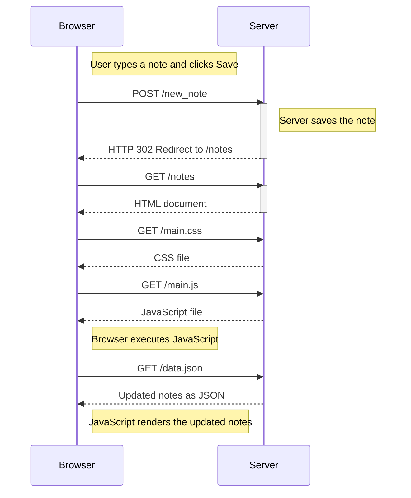

```mermaid
sequenceDiagram
    participant Browser
    participant Server


    Note right of Browser: User types a note and clicks Save


    Browser->>Server: POST /new_note
    activate Server
    Note right of Server: Server saves the note
    Server-->>Browser: HTTP 302 Redirect to /notes
    deactivate Server


    Browser->>Server: GET /notes
    activate Server
    Server-->>Browser: HTML document
    deactivate Server


    Browser->>Server: GET /main.css
    Server-->>Browser: CSS file


    Browser->>Server: GET /main.js
    Server-->>Browser: JavaScript file


    Note right of Browser: Browser executes JavaScript


    Browser->>Server: GET /data.json
    Server-->>Browser: Updated notes as JSON
 Note right of Browser: JavaScript renders the updated notes

```
