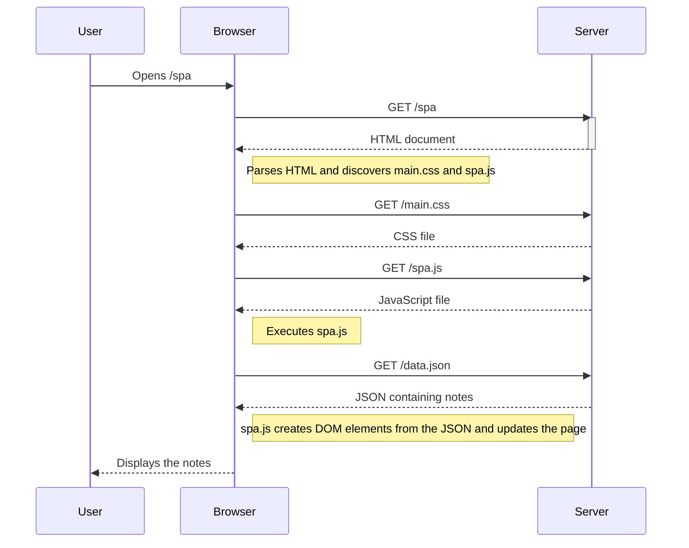

```mermaid
sequenceDiagram
    participant User
    participant Browser
    participant Server


    User->>Browser: Opens /spa


    Browser->>Server: GET /spa
    activate Server
    Server-->>Browser: HTML document
    deactivate Server


    Note right of Browser: Parses HTML and discovers main.css and spa.js


    Browser->>Server: GET /main.css
    Server-->>Browser: CSS file


    Browser->>Server: GET /spa.js
    Server-->>Browser: JavaScript file


    Note right of Browser: Executes spa.js


    Browser->>Server: GET /data.json
    Server-->>Browser: JSON containing notes


    Note right of Browser: spa.js creates DOM elements from the JSON and updates the page


    Browser-->>User: Displays the notes
```
