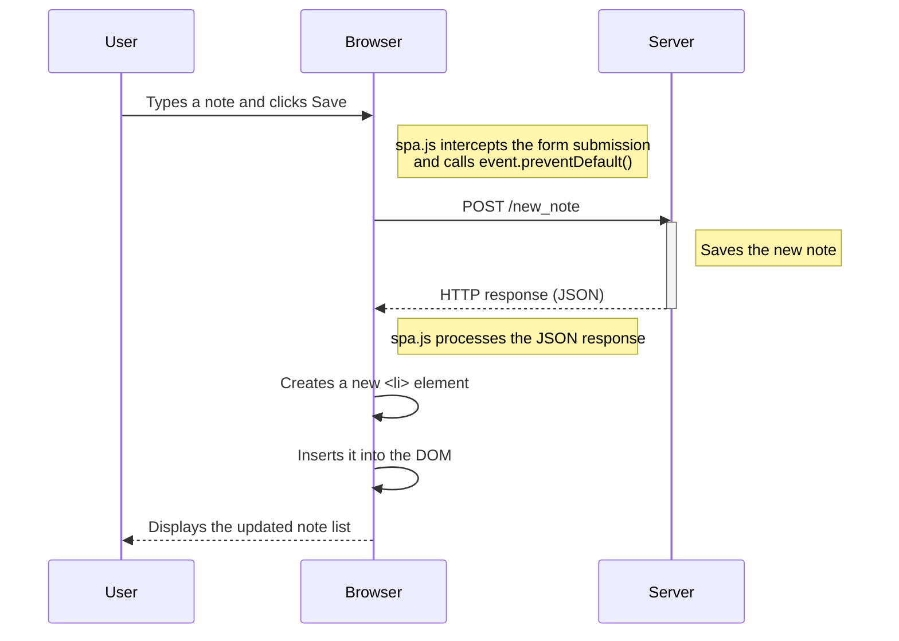

```mermaid
sequenceDiagram
    participant User
    participant Browser
    participant Server


    User->>Browser: Types a note and clicks Save


    Note right of Browser: spa.js intercepts the form submission<br/>and calls event.preventDefault()


    Browser->>Server: POST /new_note
    activate Server
    Note right of Server: Saves the new note
    Server-->>Browser: HTTP response (JSON)
    deactivate Server


    Note right of Browser: spa.js processes the JSON response


    Browser->>Browser: Creates a new <li> element
    Browser->>Browser: Inserts it into the DOM


    Browser-->>User: Displays the updated note list

```
